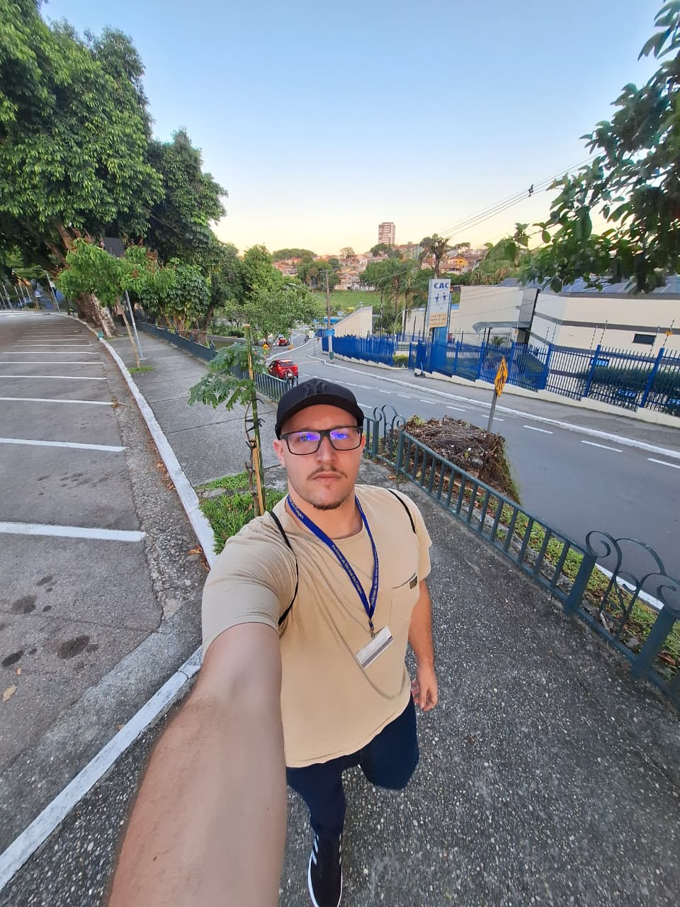

# Portfólio das APIs — Trabalho de Graduação 🧑‍🎓
# Gustavo Pereira Dos Santos Villela 🧑‍💻

## 👨‍🎓 Apresentação do Aluno

  

### Informações Pessoais Básicas
- **Nome completo:** Gustavo Pereira dos Santos de Lela  
- **Idade:** 23 anos  
- **Curso:** Análise e Desenvolvimento de Sistemas — FATEC São José dos Campos – Prof. Jessen Vidal  

---

### 🎓 Histórico Acadêmico

No primeiro semestre de **2023**, antes de ingressar na FATEC, iniciei meus estudos na **Universidade Federal de Itajubá (UNIFEI)**, no curso de **Ciências Atmosféricas**, utilizando minha nota do ENEM.  
Apesar de ser uma área pela qual sempre tive grande interesse — especialmente pelos temas de astronomia e fenômenos atmosféricos — o curso não se alinhava ao caminho profissional que eu desejava seguir. Além disso, enfrentei dificuldades relacionadas à moradia e adaptação, o que reforçou a necessidade de redirecionar meus estudos.

A experiência, porém, foi extremamente valiosa: tive meu primeiro contato com a rotina universitária, compreendi melhor meu perfil acadêmico e profissional e confirmei que buscava atuar em uma área mais alinhada à tecnologia, lógica e desenvolvimento.

---

### 🎯 Motivação para entrar na FATEC

Minha motivação para ingressar na FATEC surgiu tanto de experiências pessoais quanto de recomendações de pessoas próximas.  
Um amigo do meu pai e meu próprio pai já falavam sobre a qualidade do ensino da FATEC, e eu sempre via notícias positivas sobre seu reconhecimento na região.  
Decidi prestar a prova para ingresso ao curso de ADS na FATEC no **2º semestre de 2023**, com foco total de que iria ingressar, e para minha felicidade consegui !

Além do interesse pela área de tecnologia e pelo ensino de qualidade oferecido pela FATEC São José dos Campos, minha escolha também foi influenciada por fatores pessoais importantes. Grande parte da minha família paterna reside em São José dos Campos, incluindo meu pai, avó, tios e tias, o que me oferece apoio e estabilidade para estudar e me desenvolver profissionalmente.  

Esse suporte familiar facilitou minha adaptação à cidade e reforçou minha decisão de construir minha trajetória acadêmica e profissional aqui. Ao mesmo tempo, mantenho vínculo com minha mãe, que permanece em São Bento do Sapucaí, o que também contribuiu para que eu buscasse uma formação acessível e próxima regionalmente.

Desde jovem, sempre tive forte conexão com tecnologia: computadores, jogos, YouTube, hardware, inovação, e curiosidade sobre como as coisas funcionam “por trás da tela”. A área sempre me atraiu pela lógica, pela criatividade e pela possibilidade de construir soluções reais.

Percebi que a FATEC me oferecia:
- formação prática e voltada ao mercado,
- oportunidades reais através das APIs integradas,
- contato com empresas,
- e uma trilha sólida para desenvolver uma carreira na área de tecnologia.

Foi assim que encontrei o caminho certo e ingressei no curso de Análise e Desenvolvimento de Sistemas.

---

### 💼 Histórico Profissional

Ao longo da minha trajetória, tive experiências profissionais que contribuíram para o desenvolvimento de responsabilidade, organização e comunicação.

- **TRE – Tribunal Regional Eleitoral / Fórum de São Bento do Sapucaí**  
  - **Ano:** 2020  
  - **Ingresso:** aprovado pelo processo seletivo do CIEE durante o 3º ano do Ensino Médio  
  - **Período:** janeiro a julho de 2020  
  - **Atuação:** atividades administrativas internas, suporte aos processos eleitorais e rotina do tribunal.  
  - A experiência foi curta devido à pandemia e limitações presenciais, mas representou meu primeiro contato profissional em um órgão público de grande responsabilidade.

Atualmente, também atuo em estágio na área de TI na Prefeitura de São José dos Campos - SP, ampliando meus conhecimentos em programação, análise, documentação e manutenção de sistemas, além de aprofundar minhas habilidades técnicas e comportamentais.

### Estágio em Tecnologia da Informação — Prefeitura de São José dos Campos  
**Período:** 2025 — atual  (inicio em Outubro de 2025)
**Setor:** CAU (Central de Atendimento ao Usuário) — 1º nível

Atuo no setor de CAU da Prefeitura de São José dos Campos, onde realizo o primeiro atendimento técnico para servidores, colaboradores e terceirizados conectados ao ambiente municipal. Entre minhas atividades, estão:

- Atendimento de chamados relacionados a sistemas web, aplicativos internos, softwares desktop e ambiente Windows.  
- Suporte remoto utilizando ferramentas nativas do Windows e soluções internas.  
- Auxílio em instalação e manutenção de softwares e outros.  
- Orientação e troubleshooting para navegação, acesso a sistemas, credenciais e uso de ferramentas institucionais.  
- Abertura, identificação de problema,classificação , descrição e encaminhamento de chamados para outros setores.  

Esse estágio tem ampliado minha visão prática sobre suporte técnico, gestão de chamados e operação de sistemas públicos de grande escala, onde sou induzido a desenvolver soft & hard skills.

---

### 📬 Informações de Contato
- **GitHub:** https://github.com/TaldoGus  
- **LinkedIn:** *https://www.linkedin.com/in/
 gustavo-villela-a9314b268/*  
- **E-mail:** *( )*  

---

### 🧠 Principais Conhecimentos

- Desenvolvimento Web (HTML, CSS, React, Typescript)  
- Desenvolvimento Mobile (Android Studio, React Native)  
- Desenvolvimento Backend (Python, Node.js)  
- Banco de Dados (MySQL, PostgreSQL, MongoDB)  
- Controle de Versão com Git e GitHub  
- Metodologias Ágeis (Scrum, Kanban)  
- Lógica de Programação e Estruturas de Dados  
- Modelagem de sistemas e documentação técnica  
- Dev Ops (AWS)
- UI (FIGMA)

---

#  Projetos

A seguir as seções expansíveis com o conteúdo inteiro dos meus projetos. Clique para expandir e ter todo o conteúdo descritivo da API referente a cada semestre.

### 📅 Semestre 2023/2 — API 1

  
<strong>Clique para abrir a descrição completa da API 1</strong>

  

Todo o conteúdo detalhado desta API está disponível no arquivo abaixo:

👉 **[API 1 – Detalhamento Completo](./API1.md)**

  

---

### 📅 Semestre 2024/1 — API 2

  
<strong>Clique para abrir a descrição completa da API 2</strong>

  

A documentação completa desta API pode ser encontrada no arquivo:

👉 **[API 2 – Detalhamento Completo](./API2.md)**

  

---

### 📅 Semestre 2024/2 — API 3

  
<strong>Clique para abrir a descrição completa da API 3</strong>

  

Veja todos os detalhes técnicos, entregas e tecnologias desta API no arquivo:

👉 **[API 3 – Detalhamento Completo](./API3.md)**

  

---

### 📅 Semestre 2025/1 — API 4

  
<strong>Clique para abrir a descrição completa da API 4</strong>

  

A documentação completa desta API está organizada no arquivo:

👉 **[API 4 – Detalhamento Completo](./API4.md)**

  

---

### 📅 Semestre 2025/2 — API 5

  
<strong>Clique para abrir a descrição completa da API 5</strong>

  

Veja todos os detalhes técnicos, entregas e tecnologias desta API no arquivo:

👉 **[API 5 – Detalhamento Completo](./API5.md)**

  

---

### 📅 Semestre 2026/1 — API 6

  
<strong>Clique para abrir a descrição completa da API 6</strong>

  

Veja todos os detalhes técnicos, entregas e tecnologias desta API no arquivo:

👉 **[API 6 – Detalhamento Completo](./API6.md)**

  

---

## 📚 Objetivo do Trabalho de Graduação

Este TG tem como objetivo apresentar meu crescimento técnico e profissional ao longo da graduação por meio de projetos reais desenvolvidos em equipe, documentando minha atuação, competências e aprendizados.

---

**Obrigado pela visita ao meu portfólio!** ✨  
Se quiser conversar sobre algum dos projetos, fique à vontade para entrar em contato!

